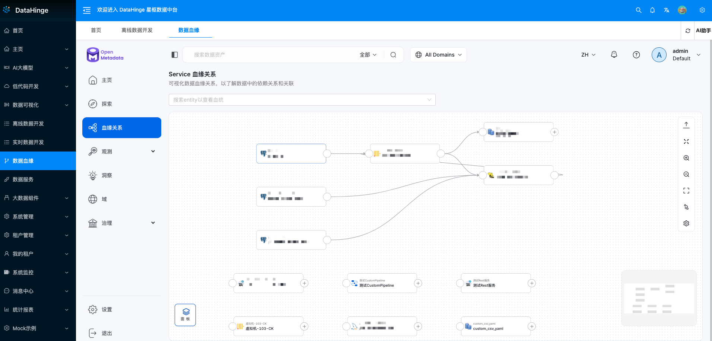

# 星枢数据中台

## 📚 项目简介
星枢数据中台(DataHinge) 是一站式数据中台解决方案，提供从数据集成、开发、治理到应用的全链路数字化能力。

**项目寓意**

- 名称来源：星（数据如星辰）+ 枢（枢纽/中枢）
- 核心理念：通过可靠的技术连接，化解数据孤岛，实现业务价值
- 产品定位：以云原生平台为底座，数据中台为桥梁，大模型为动力，支持业务场景快速落地

## ✨ 系统特性

- 🎯 **一站式解决方案**: 提供完整的数据中台建设所需的所有组件
- 🔐 **企业级安全**: 多租户架构，细粒度权限控制
- 🚀 **高性能**: 分布式架构，支持海量数据处理
- 🎨 **可视化**: 拖拽式开发，丰富的图表组件
- 🔄 **实时处理**: 支持实时数据同步和计算
- 📊 **全链路管理**: 数据全生命周期管理和血缘分析

## 🛠 核心组件及功能

### 数据门户(JeecgBoot+Keycloak)

**JeecgBoot** 是一款基于 Java 的开源低代码开发平台，旨在通过可视化设计、代码生成等功能，帮助开发者快速构建企业级应用系统。其核心定位是 “敏捷开发 + 低代码”，既能满足复杂业务场景的开发需求，又能大幅提升开发效率，适用于政务、企业管理、物联网等多领域项目。

数据中台门户选择**JeecgBoot**版本为**v3.8.1**，目前使用的功能

| 功能             | 文档地址                                                     | 备注 |
| ---------------- | ------------------------------------------------------------ | ---- |
| 动态路由菜单配置 | https://help.jeecg.com/config/menu/new                       |      |
| 积木报表         | https://help.jimureport.com/base/new                         |      |
| 积木BI           | https://help.jimureport.com/biScreen/ https://juejin.cn/post/7447033901656702986 |      |

**产品截图**

### 离线数据开发(dolphinScheduler)

**DolphinScheduler** 是一款由 Apache 开源的分布式工作流任务调度系统，旨在解决数据处理流程中多任务间的依赖关系，并实现任务的调度与监控。其核心价值在于将复杂的工作流编排可视化，通过 DAG（有向无环图）方式定义任务间的依赖关系，支持多种计算引擎（如 Spark、Flink、Hive 等），广泛应用于数据仓库、ETL、机器学习等场景。

数据中台离线数据开发选择**DolphinScheduler**版本为**3.2.2**，目前使用的功能

| 功能       | 文档地址                                                     | 备注 |
| ---------- | ------------------------------------------------------------ | ---- |
| 项目管理   | https://dolphinscheduler.apache.org/zh-cn/docs/3.2.2/guide/project/project-list |      |
| 流水线开发 | https://dolphinscheduler.apache.org/zh-cn/docs/3.2.2/guide/project/workflow-definition |      |
| datax作业  | https://dolphinscheduler.apache.org/zh-cn/docs/3.2.2/guide/task/datax |      |
| sql作业    | https://dolphinscheduler.apache.org/zh-cn/docs/3.2.2/guide/task/sql |      |

**产品截图**

### 实时数据开发(Dinky+Flink+Kafka)

Dinky 是一个开箱即用、易扩展，以 Apache Flink 为基础，连接 OLAP 和数据湖等众多框架的一站式实时计算平台，致力于流批一体和湖仓一体的探索与实践。 致力于简化Flink任务开发，提升Flink任务运维能力，降低Flink入门成本，提供一站式的Flink任务开发、运维、监控、报警、调度、数据管理等功能。

数据中台离线数据开发选择**Dinky**版本为**1.2.3**，Flink版本为**1.20.0**, **Kafka**版本为**4.0**，目前可使用的核心特性

- **开发体验优越**：提供沉浸式 Flink SQL 数据开发环境，具备自动提示补全、语法高亮、语句美化、在线调试、语法校验等功能，还支持血缘分析、版本对比等。
- **多版本与执行模式**：支持 Flink SQL 多版本开发，以及 Local、Standalone、Yarn/Kubernetes Session 等多种执行模式。
- **强大的生态支持**：支持 Apache Flink 生态，如 Connector、Flink CDC、Table Store 等；支持 Flink CDC 整库实时入仓入湖、多库输出等。
- **语法增强**：支持 Flink SQL 语法增强，包括表值聚合函数、全局变量、语句合并等。
- **多数据库支持**：支持 ClickHouse、Doris、Hive、Mysql 等多种数据库的 SQL 作业开发。
- **实时调试预览**：支持实时在线调试预览 Table、ChangeLog、统计图和 UDF。
- **元数据管理**：支持 Flink Catalog、数据源元数据在线查询及管理。
- **任务运维便捷**：支持实时任务运维，包括上线下线、作业信息查看、异常信息查看等，还支持自动托管的 SavePoint/CheckPoint 恢复及触发机制。
- **具备 Server 能力**：支持作为多版本 Flink SQL Server 以及 OpenApi 的能力。
- **实时作业报警**：支持实时作业报警及报警组，可对接钉钉、微信企业号、飞书、邮箱等。
- **资源与企业级管理**：支持多种资源管理，包括集群实例、集群配置等；具备企业级管理功能，如多租户、用户、角色管理等。

**文档**：https://www.dinky.org.cn/docs/next/get_started/quick_experience/

### 数据治理(openmetadata)

**OpenMetadata** 是一个开源的元数据管理与数据治理平台，旨在帮助企业统一管理分散在各系统中的元数据，实现数据资产的发现、理解与治理。作为 Apache 孵化器项目（现为毕业项目），它通过标准化元数据模型和开放 API，连接数据仓库、湖仓、BI 工具等各类数据源，支持数据血缘追踪、数据分类、权限管理等核心功能，广泛应用于数据密集型企业的数据治理场景。

数据中台数据血缘选择**openmetadata**版本为**1.7.1**

**核心功能模块**

1. **元数据采集与整合**
   - 支持自动发现 80+ 数据源（如 Snowflake、Redshift、MySQL、Hive、Kafka 等）
   - 提供 SDK、API、CLI 多种采集方式，支持实时增量采集
   - 兼容 OpenLineage、DataHub 等元数据标准，支持跨平台数据互通
2. **数据血缘与影响分析**
   - 自动构建数据资产的血缘关系图（从数据源到应用的全链路追踪）
   - 支持 SQL 解析获取表级 / 列级血缘，定位数据变更影响范围
   - 可视化展示数据流转路径，辅助故障排查与合规审计
3. **数据发现与搜索**
   - 全文检索与语义搜索结合，支持字段级搜索（如 “查找含用户隐私的字段”）
   - 基于标签、业务术语、所有者等维度的智能过滤
   - 推荐相关数据资产（如相似表、高频使用表）
4. **数据治理与分类**
   - 自定义数据分类体系（如 PII、敏感数据、公共数据）
   - 自动化数据标记（通过规则引擎识别敏感字段）
   - 数据质量监控与告警（结合 Great Expectations 等工具）
5. **权限与协作管理**
   - 基于角色的访问控制（RBAC）与细粒度权限管理
   - 数据资产的所有者分配与协作流程（如数据申请、审批）
   - 评论、标签、文档等协作功能，促进数据团队知识共享

**文档**：https://docs.open-metadata.org/v1.7.x/how-to-guides

**产品截图**

### 数据服务(magicapi)

一个基于Java的接口快速开发框架，通过magic-api提供的UI界面完成编写接口，无需定义Controller、Service、Dao、Mapper、XML、VO等Java对象即可完成常见的HTTP API接口开发

更多特性介绍: https://www.ssssssss.org/magic-api/pages/quick/intro/

**使用级别**

1. 指南-快速入门-简介
2. 指南-基础教程-界面简介
3. 指南-快速入门-[增删改查,单表crud接口,分页]
4. API-[模块,函数,扩展]
5. 指南-基础教程-脚本语法
6. 指南-基础教程-[参数校验,...,Linq] 和 指南-快速入门-请求参数获取

**配置和部署级别**

1. 指南-快速入门-快速开始
2. 配置-SpringBoot配置
3. 指南-基础教程-配置多数据源
4. 指南-基础教程-[统一请求响应，统一异常处理]
5. 指南-权限配置
6. 指南-高级应用
7. 指南-插件-[集群插件，...., nebula插件]

**定制化开发级别**

1. 配置-编辑器配置
2. 指南-插件-插件开发

**产品截图**

### 数据质量(dolphinScheduler/openmetadata)

dolphinScheduler内置数据质量功能，形式为数据质量作业，可以其它类型的作业相互依赖，原理是通过选择内置的数据质量规则，配置dolphinscheduler数据质量作业，通过spark连接数据源批量执行规则

功能介绍：https://dolphinscheduler.apache.org/zh-cn/docs/3.2.2/guide/data-quality

openmetadata也有数据质量功能，和dolphinscheduler类似，但是执行引擎应该是jdbc

### 监控体系(telegraf+influxdb+grafana)

选择 **Telegraf + InfluxDB + Grafana**（简称 **TIG 栈**）作为监控解决方案，主要得益于三者在功能上的高度互补性、对时序数据的深度优化，以及在易用性、扩展性和生态适配性上的优势

**Telegraf**是轻量级、插件化的数据采集代理（agent），专注于**多源数据收集与转发**，不局限于特定监控对象，需要同时监控 **系统（物理机 / 虚拟机）+ 容器 + 应用**（如 MySQL 连接数、Redis 内存）

**InfluxDB**专为时间戳数据设计，存储结构按时间分区，写入和查询速度比传统关系型数据库（如 MySQL）快 **10-100 倍**，尤其适合高频写入场景（如每秒数万条指标）。

**Grafana**可视化与告警的 一站式平台, 拖拽式仪表盘设计, 多数据源兼容与联动, 灵活的告警机制

**主机监控**

**容器监控 **

## 体验地址

体验地址：http://47.102.87.127:8081
体验账号：demo/demo

目前是基于虚拟机单机部署，CPU MEM 磁盘 网络 都很捉襟见肘，望海涵

## 联系我们

关注微信公众号【星枢数据中台】

<strong>公众号审核中，暂时闲鱼上搜【星枢数据中台】</strong>
